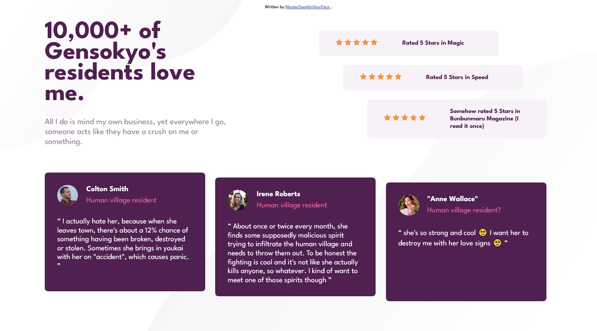

# Frontend Mentor - Social proof section solution

This is a solution to the [Social proof section challenge on Frontend Mentor](https://www.frontendmentor.io/challenges/social-proof-section-6e0qTv_bA).

## Overview

### Screenshots (desktop and mobile viewports)

### Built with

- HTML5
- Sass (SCSS)
- flexbox
- grid

### Resources

- [MDN](https://developer.mozilla.org): first reference for web things
- [Sass docs](https://sass-lang.com/documentation): SCSS reference
- [StackOverflow](https://stackoverflow.com): obviously